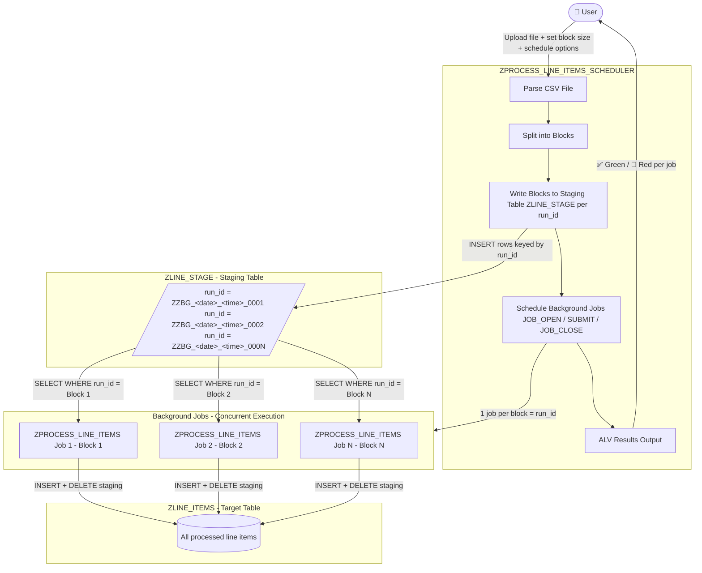

# sap-abapgit-Z_CODE_EXERCISE

# High Level Architecture Diagram




# Technical Documentation — Report `ZPROCESS_LINE_ITEMS_SCHEDULER`

## 1) Purpose & Scope
`ZPROCESS_LINE_ITEMS_SCHEDULER` is a foreground “controller” report that:
- Uploads a local CSV/TXT file from the SAP GUI frontend
- Parses it into internal line items (`LINE_ID`, `LINE_TEXT`)
- Splits the parsed data into configurable “blocks”
- Persists each block into a staging database table (`ZLINE_STAGE`) using a `RUN_ID`
- Schedules one background job per block to execute worker report `ZPROCESS_LINE_ITEMS`, passing the `RUN_ID` via parameter `P_MEMID`
- Displays a scheduling summary in an ALV grid (SALV)

This design decouples foreground file upload and block preparation from background processing, enabling parallelization and resilient cross-session job execution.

---

## 2) High-level Program Flow

### 2.1 End-to-end flow
```text
User executes report
  |
  |-- Selection screen validation & UI toggling (immediate vs scheduled)
  |
START-OF-SELECTION
  |
  |-- ZCL_FILE_READER=>READ_FILE( p_file )  -> lt_lines
  |      - skips header line
  |      - parses CSV: col1=line_id, col2=line_text
  |
  |-- ZCL_JOB_SCHEDULER( block size, schedule options )
  |
  |-- BUILD_BLOCKS( lt_lines ) -> lt_blocks
  |
  |-- SCHEDULE_ALL( lt_blocks ) -> lt_results
  |      For each block:
  |        - derive JOB_NAME & RUN_ID
  |        - write block rows to ZLINE_STAGE for RUN_ID
  |        - JOB_OPEN
  |        - SUBMIT ZPROCESS_LINE_ITEMS WITH p_memid = RUN_ID VIA JOB
  |        - JOB_CLOSE (immediate or scheduled)
  |        - if failure: cleanup ZLINE_STAGE for RUN_ID
  |
  |-- ZCL_ALV_DISPLAY=>DISPLAY( lt_results )
```

### 2.2 Scheduling strategy
- **One block = one background job**  
- **Block payload persistence**: inserted into `ZLINE_STAGE` keyed by `RUN_ID` (here: `RUN_ID = JOB_NAME`)
- **Worker job linkage**: `SUBMIT zprocess_line_items WITH p_memid = RUN_ID`

> Note: Despite the parameter being named `P_MEMID`, the implementation uses a database staging table (not ABAP memory) so the data is accessible in background processing.

---

## 3) Selection Screen Behavior & Validation

### 3.1 Parameters
- `P_FILE` (localfile, obligatory): frontend file to upload
- `P_BLKSZ` (i, default 5, obligatory): number of file rows per block/job
- Radiobuttons:
  - `P_IMMED` (default X): schedule immediately
  - `P_SCHED`: schedule at a date/time
- `P_DATE`, `P_TIME`: only active when `P_SCHED = X`

### 3.2 Dynamic screen control (`AT SELECTION-SCREEN OUTPUT`)
- If `P_SCHED = X`, fields `P_DATE` and `P_TIME` are activated/input-enabled.
- Otherwise, they are hidden/disabled.

### 3.3 Validation (`AT SELECTION-SCREEN`)
- If scheduled mode:
  - `P_DATE` required
  - `P_TIME` required
  - `P_DATE` must not be in the past (`P_DATE < SY-DATUM` error)
- Block size must be > 0 (`P_BLKSZ <= 0` error)

---

## 4) Classes and Methods (Detailed)

## 4.1 `ZCL_FILE_READER`
**Responsibility:** Upload and parse file into structured line items.

### Method: `READ_FILE`
**Signature**
- Importing: `IV_FILEPATH TYPE LOCALFILE`
- Exporting: `ET_LINES TYPE TT_FILE_LINES`
- Returning: `RV_OK TYPE ABAP_BOOL`

**Behavior**
1. Uploads the file via `CL_GUI_FRONTEND_SERVICES=>GUI_UPLOAD` (filetype `ASC`) into `LT_RAW` (table of `string`)
2. Skips the first row (assumed header)
3. For each subsequent line:
   - `CONDENSE` the line
   - `SPLIT ... AT ',' INTO TABLE LV_PARTS`
   - Requires at least 2 columns
   - Maps:
     - `line_id   = lv_parts[ 1 ]`
     - `line_text = lv_parts[ 2 ]`
4. Sets `RV_OK = ABAP_TRUE` if at least one valid line was parsed

**Assumptions / Constraints**
- Comma-separated (`,`), no quoting/escape handling shown (e.g., embedded commas in text are not supported by this parser).
- The first line is always a header and is ignored.

---

## 4.2 `ZCL_JOB_SCHEDULER`
**Responsibility:** Block creation, staging persistence, job creation and scheduling.

### Public Types
- `TY_BLOCK_INFO`: block metadata and payload
  - `BLOCK_NO`, `FROM_IDX`, `TO_IDX`, `ITEMS` (`TT_FILE_LINES`)
- `TT_BLOCKS`: table of `TY_BLOCK_INFO`

### Constructor
**Parameters**
- `IV_BLOCK_SIZE`
- `IV_SCHED_IMMED`
- `IV_SCHED_DATE`
- `IV_SCHED_TIME`

**Behavior**
- Stores scheduling parameters
- Determines effective run date/time:
  - If immediate: `MV_RUN_DATE = SY-DATUM`, `MV_RUN_TIME = SY-UZEIT`
  - Else: `MV_RUN_DATE = IV_SCHED_DATE`, `MV_RUN_TIME = IV_SCHED_TIME`

> This run date/time is used for job naming and ALV display; scheduled start uses `MV_SCHED_DATE` and `MV_RUN_TIME` in `JOB_CLOSE`.

---

### Method: `BUILD_BLOCKS`
**Input:** `IT_LINES TYPE TT_FILE_LINES`  
**Output:** `RT_BLOCKS TYPE TT_BLOCKS`

**Behavior**
- Iterates through `IT_LINES` and chunks rows by `MV_BLOCK_SIZE`
- Each block:
  - Sets `FROM_IDX` and `TO_IDX`
  - Copies the corresponding subset of lines into `BLOCK-ITEMS`

---

### Method: `SCHEDULE_ALL`
**Input:** `IT_BLOCKS TYPE TT_BLOCKS`  
**Output:** `ET_RESULTS TYPE TT_ALV_RESULTS`

**Behavior**
- Loops over blocks
- Calls `SCHEDULE_SINGLE_BLOCK` per block
- Appends result rows for ALV

**Note on throttling**
- There is a *commented-out* BTC work process availability check (`ZCL_BTC_CHECK=>WAIT_FOR_FREE_PROCESSES`), indicating a planned safeguard against over-scheduling.

---

### Private Method: `SCHEDULE_SINGLE_BLOCK`
**Input:** `IS_BLOCK TYPE TY_BLOCK_INFO`  
**Output:** `ES_RESULT TYPE TY_ALV_RESULT`

**Behavior**
1. Build job name (`BUILD_JOB_NAME`)
2. Set `RUN_ID = JOB_NAME` (acts as block key)
3. Persist the block payload to database staging (`WRITE_BLOCK_TO_STAGE`)
   - On failure: mark error, return
4. `JOB_OPEN` to create the job
   - On failure: mark error, cleanup `ZLINE_STAGE` for run_id, return
5. `SUBMIT zprocess_line_items WITH p_memid = run_id VIA JOB ... AND RETURN`
   - On failure:
     - mark error
     - attempt `JOB_CLOSE` with dummy scheduling to release job
     - cleanup staging rows
     - return
6. `JOB_CLOSE`
   - If immediate: `STRTIMMED = 'X'`
   - If scheduled: `SDLSTRTDT = MV_SCHED_DATE`, `SDLSTRTTM = MV_RUN_TIME`
   - On failure: mark error, cleanup staging
   - On success: success icon/message

**Result fields populated**
- `JOB_NAME`, `SCHED_DATE`, `SCHED_TIME`, `BLOCK_FROM`, `BLOCK_TO`
- `ICON` (success or error)
- `MESSAGE` (human-readable outcome)

**Cleanup strategy**
- If job creation/scheduling fails at any stage, staging rows for `RUN_ID` are deleted to avoid orphaned data.

---

### Private Method: `BUILD_JOB_NAME`
**Input:** `IV_BLOCK_NO TYPE I`  
**Output:** `RV_NAME TYPE BTCJOB`

**Format**
- `ZZBG_<YYYYMMDD>_<HHMMSS>_<BLOCKNO_4DIGITS>`
- Example: `ZZBG_20260313_101530_0001`

This makes job naming deterministic and traceable per run time and block.

---

### Private Method: `WRITE_BLOCK_TO_STAGE`
**Inputs**
- `IS_BLOCK TYPE TY_BLOCK_INFO`
- `IV_RUN_ID TYPE C` (length 30)

**Output**
- `RV_OK TYPE ABAP_BOOL`

**Behavior**
- Builds an internal table of `ZLINE_STAGE` rows
- Inserts all rows via `INSERT zline_stage FROM TABLE lt_stage`
- Returns true if insert succeeds (`SY-SUBRC = 0`)

**Dependency**
- Requires a DDIC table/structure `ZLINE_STAGE` with fields at least:
  - `RUN_ID`, `LINE_ID`, `LINE_TEXT`

---

## 4.3 `ZCL_ALV_DISPLAY`
**Responsibility:** Display scheduling outcomes.

### Class-method: `DISPLAY`
**Input:** `IT_RESULTS TYPE TT_ALV_RESULTS`

**Behavior**
- Uses `CL_SALV_TABLE=>FACTORY` to render ALV grid
- Enables all ALV functions
- Enables layout saving (no restriction)
- Optimizes column widths
- Configures column headers and sets `ICON` column as icon-enabled

---

## 5) Expected Output

## 5.1 ALV Report Output (Scheduling Summary)
After execution, the report displays an ALV grid with one row per scheduled block/job:

| Column | Meaning |
|---|---|
| Status (ICON) | Success (`@09@`) or Error (`@0A@`) |
| Job Name | Generated background job name (e.g., `ZZBG_...`) |
| Scheduled Date | Effective run date shown (immediate: today; scheduled: chosen date) |
| Scheduled Time | Effective run time shown |
| Block From / Block To | Line indices from the parsed file assigned to this block |
| Message | “Successfully scheduled” or an error explanation (e.g., JOB_OPEN/SUBMIT/JOB_CLOSE failure, staging write failure) |

## 5.2 Background execution expectation
For each scheduled job:
- Program `ZPROCESS_LINE_ITEMS` runs with `P_MEMID = RUN_ID`
- The worker program is expected to:
  1. Read staged rows from `ZLINE_STAGE` for the given `RUN_ID`
  2. Process the line items
  3. (Ideally) delete/cleanup processed staging rows (not shown in this report)

---

## 6) Operational Notes / Best-practice Considerations (Concise)
- **Frontend upload dependency:** `GUI_UPLOAD` requires SAP GUI (won’t work in pure background execution of the scheduler report).
- **CSV robustness:** current parsing is simple (split by comma, no quoted fields). If business data may contain commas, a CSV parser strategy is recommended.
- **Data lifecycle:** scheduler cleans staging rows only on scheduling failures. Ensure the worker (`ZPROCESS_LINE_ITEMS`) cleans up after successful processing to avoid table growth.
- **Uniqueness:** `RUN_ID = JOB_NAME` relies on timestamp granularity; rapid consecutive runs could theoretically collide if same `mv_run_date/time` and block numbers repeat. Consider appending a GUID or `SY-UNAME`/`SY-REPID`/counter if collisions are a concern.

---
